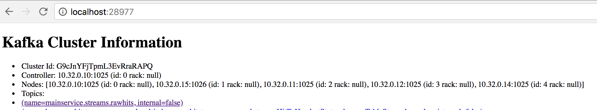
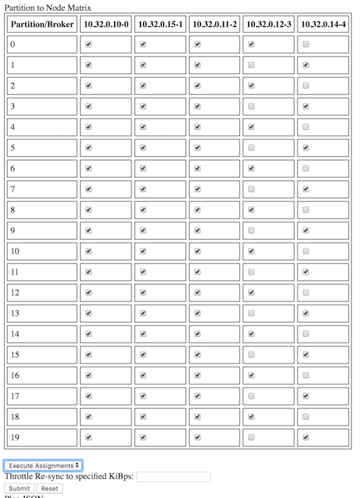

# KafkaManager
A tool for adjusting the replication factors of kafka topics.

*This is a WIP*

## Screen Shots ##

### Cluster Overview Display ###



### Partition Assignment Matrix ###


## Directions ##

The workflow of this tool is preliminary. The exposed
Scala API from the upstream Kafka admin tool collection is not designed
to be used as an integration point for third part tools.

Much status information is still logged to STDOUT instead of propagated to the UI.

### Example Marathon App Definition ###

[Docker Hub Link](https://hub.docker.com/r/becoinc/kafka_repartition_tool/)

It's easy to deploy this tool with DC/OS - Marathon:

```json
{
    "id"   : "kafka-repartition-tool",
    "cpus" : 0.5,
    "mem"  : 512,
    "instances" : 1,
    "container": {
        "type": "DOCKER",
        "docker": {
            "image": "becoinc/kafka_repartition_tool:latest",
            "network": "BRIDGE",
            "forcePullImage": true,
            "portMappings": [
                {
                    "hostPort": 0,
                    "containerPort": 8080,
                    "servicePort": 0
                }
            ]
        }
    },
    "env": {
        "SPRING_KAFKA_BOOTSTRAP-SERVERS[0]" : "broker.kafka.l4lb.thisdcos.directory:9092",
        "ZOOKEEPER_URL" : "zk-1.zk:2181,zk-2.zk:2181,zk-3.zk:2181,zk-4.zk:2181,zk-5.zk:2181/dcos-service-kafka"
    },
    "labels": {
        "PROMETHEUS_MONITOR": "http"
    },
    "healthChecks": [
        {
            "protocol": "HTTP",
            "portIndex" : 0,
            "path" : "/internal/monitor/health",
            "gracePeriodSeconds": 180,
            "timeoutSeconds": 5,
            "intervalSeconds": 10,
            "maxConsecutiveFailures": 3
        }
    ],
    "upgradeStrategy": {
        "minimumHealthCapacity": 0,
        "maximumOverCapacity": 0
    }
}
```

## Contributing ##

`Master` branch is the current stable version.

`Develop` branch is the current CI/CD branch. 